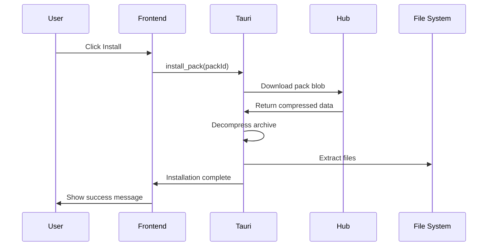
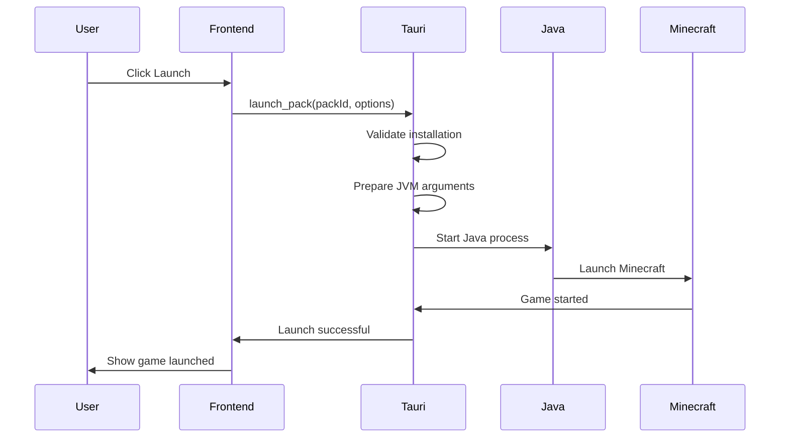

# Atlas Launcher Developer Documentation

The Atlas Launcher is a desktop application built with Vue.js and Tauri that provides a graphical interface for managing and launching Minecraft modpacks.

## Architecture

### Technology Stack
```json
{
  "frontend": {
    "framework": "Vue 3",
    "language": "TypeScript",
    "styling": "Tailwind CSS",
    "ui": "shadcn-vue",
    "icons": "Lucide"
  },
  "backend": {
    "runtime": "Tauri",
    "language": "Rust",
    "bundler": "Vite"
  },
  "build": {
    "package_manager": "pnpm",
    "ci": "GitHub Actions"
  }
}
```

### Dependencies
```json
// package.json
{
  "dependencies": {
    "vue": "^3.4.0",
    "vue-router": "^4.2.0",
    "pinia": "^2.1.0",
    "@tauri-apps/api": "^1.5.0",
    "lucide-vue-next": "^0.294.0"
  },
  "devDependencies": {
    "@vitejs/plugin-vue": "^4.5.0",
    "typescript": "^5.3.0",
    "tailwindcss": "^3.4.0",
    "autoprefixer": "^10.4.0",
    "postcss": "^8.4.0"
  }
}
```

### Module Structure
```
src/
├── main.ts              # Application entry point
├── App.vue              # Root component
├── components/          # Vue components
│   ├── ui/             # Reusable UI components
│   ├── packs/          # Pack management components
│   ├── auth/           # Authentication components
│   └── settings/       # Settings components
├── views/               # Page components
│   ├── Home.vue        # Main dashboard
│   ├── Packs.vue       # Pack browser
│   ├── Library.vue     # Installed packs
│   ├── Settings.vue    # Application settings
│   └── Profile.vue     # User profile
├── stores/              # Pinia state management
│   ├── auth.ts         # Authentication state
│   ├── packs.ts        # Pack management state
│   └── settings.ts     # Application settings
├── lib/                 # Utilities and helpers
│   ├── api.ts          # Hub API client
│   ├── utils.ts        # General utilities
│   └── validation.ts   # Form validation
├── types/               # TypeScript definitions
│   ├── pack.ts         # Pack-related types
│   ├── user.ts         # User-related types
│   └── api.ts          # API response types
└── assets/              # Static assets
    ├── icons/          # Application icons
    └── images/         # Images and illustrations
```

## Core Components

### Application Bootstrap

#### Main Entry Point
```typescript
// src/main.ts
import { createApp } from 'vue'
import { createPinia } from 'pinia'
import { createRouter } from './router'
import App from './App.vue'

import './assets/main.css'

const app = createApp(App)
const pinia = createPinia()
const router = createRouter()

app.use(pinia)
app.use(router)

app.mount('#app')
```

#### Tauri Integration
```typescript
// src/lib/tauri.ts
import { invoke } from '@tauri-apps/api/tauri'

// Tauri command invocations
export const tauriCommands = {
  async getSystemInfo(): Promise<SystemInfo> {
    return await invoke('get_system_info')
  },

  async launchPack(packId: string, options: LaunchOptions): Promise<void> {
    return await invoke('launch_pack', { packId, options })
  },

  async installPack(packId: string): Promise<void> {
    return await invoke('install_pack', { packId })
  }
}
```

### State Management

#### Authentication Store
```typescript
// src/stores/auth.ts
import { defineStore } from 'pinia'
import { ref, computed } from 'vue'

export const useAuthStore = defineStore('auth', () => {
  const user = ref<User | null>(null)
  const token = ref<string | null>(null)
  const isLoading = ref(false)

  const isAuthenticated = computed(() => !!token.value)

  async function login(credentials: LoginCredentials) {
    isLoading.value = true
    try {
      const response = await api.login(credentials)
      user.value = response.user
      token.value = response.token
      // Persist token
      localStorage.setItem('auth_token', response.token)
    } finally {
      isLoading.value = false
    }
  }

  async function logout() {
    user.value = null
    token.value = null
    localStorage.removeItem('auth_token')
  }

  function initializeAuth() {
    const savedToken = localStorage.getItem('auth_token')
    if (savedToken) {
      token.value = savedToken
      // Validate token and fetch user
    }
  }

  return {
    user,
    token,
    isLoading,
    isAuthenticated,
    login,
    logout,
    initializeAuth
  }
})
```

#### Pack Management Store
```typescript
// src/stores/packs.ts
import { defineStore } from 'pinia'
import { ref, computed } from 'vue'

export const usePacksStore = defineStore('packs', () => {
  const packs = ref<Pack[]>([])
  const installedPacks = ref<InstalledPack[]>([])
  const loading = ref(false)

  const availablePacks = computed(() =>
    packs.value.filter(pack => !installedPacks.value.find(ip => ip.id === pack.id))
  )

  async function fetchPacks() {
    loading.value = true
    try {
      packs.value = await api.getPacks()
    } finally {
      loading.value = false
    }
  }

  async function installPack(packId: string) {
    const pack = packs.value.find(p => p.id === packId)
    if (!pack) return

    await tauriCommands.installPack(packId)
    installedPacks.value.push({
      id: packId,
      name: pack.name,
      version: pack.latestVersion,
      installedAt: new Date()
    })
  }

  async function launchPack(packId: string) {
    const installedPack = installedPacks.value.find(p => p.id === packId)
    if (!installedPack) return

    await tauriCommands.launchPack(packId, {
      memory: 4096,
      javaArgs: []
    })
  }

  return {
    packs,
    installedPacks,
    loading,
    availablePacks,
    fetchPacks,
    installPack,
    launchPack
  }
})
```

### API Integration

#### Hub API Client
```typescript
// src/lib/api.ts
import { fetch } from '@tauri-apps/api/http'

class HubApiClient {
  private baseUrl: string
  private token: string | null = null

  constructor(baseUrl: string) {
    this.baseUrl = baseUrl
  }

  setToken(token: string) {
    this.token = token
  }

  private async request<T>(
    endpoint: string,
    options: RequestInit = {}
  ): Promise<T> {
    const url = `${this.baseUrl}${endpoint}`
    const headers: Record<string, string> = {
      'Content-Type': 'application/json'
    }

    if (this.token) {
      headers['Authorization'] = `Bearer ${this.token}`
    }

    const response = await fetch(url, {
      ...options,
      headers: {
        ...headers,
        ...options.headers
      }
    })

    if (!response.ok) {
      throw new Error(`API request failed: ${response.status}`)
    }

    return response.data as T
  }

  async getPacks(): Promise<Pack[]> {
    return this.request('/api/packs')
  }

  async getPack(packId: string): Promise<PackDetails> {
    return this.request(`/api/packs/${packId}`)
  }

  async login(credentials: LoginCredentials): Promise<AuthResponse> {
    return this.request('/api/auth/login', {
      method: 'POST',
      body: JSON.stringify(credentials)
    })
  }

  async getUserProfile(): Promise<User> {
    return this.request('/api/user/profile')
  }
}

export const api = new HubApiClient('https://hub.atlaslauncher.com')
```

### Component Architecture

#### Base UI Components
```vue
<!-- src/components/ui/Button.vue -->
<template>
  <button
    :class="buttonClasses"
    @click="$emit('click')"
  >
    <slot />
  </button>
</template>

<script setup lang="ts">
import { computed } from 'vue'

interface Props {
  variant?: 'primary' | 'secondary' | 'outline'
  size?: 'sm' | 'md' | 'lg'
  disabled?: boolean
}

const props = withDefaults(defineProps<Props>(), {
  variant: 'primary',
  size: 'md',
  disabled: false
})

const buttonClasses = computed(() => {
  const classes = ['btn']

  classes.push(`btn-${props.variant}`)
  classes.push(`btn-${props.size}`)

  if (props.disabled) {
    classes.push('btn-disabled')
  }

  return classes.join(' ')
})
</script>

<style scoped>
.btn {
  @apply inline-flex items-center justify-center rounded-md font-medium
         transition-colors focus-visible:outline-none focus-visible:ring-2
         focus-visible:ring-ring focus-visible:ring-offset-2
         disabled:pointer-events-none disabled:opacity-50;
}

.btn-primary {
  @apply bg-primary text-primary-foreground hover:bg-primary/90;
}

.btn-secondary {
  @apply bg-secondary text-secondary-foreground hover:bg-secondary/80;
}

.btn-outline {
  @apply border border-input bg-background hover:bg-accent hover:text-accent-foreground;
}

.btn-sm { @apply h-9 px-3 text-sm; }
.btn-md { @apply h-10 px-4 py-2; }
.btn-lg { @apply h-11 px-8; }
</style>
```

#### Pack Card Component
```vue
<!-- src/components/packs/PackCard.vue -->
<template>
  <div class="pack-card">
    <div class="pack-header">
      
      <div class="pack-info">
        <h3 class="pack-title">{{ pack.name }}</h3>
        <p class="pack-description">{{ pack.description }}</p>
        <div class="pack-meta">
          <span class="pack-version">v{{ pack.latestVersion }}</span>
          <span class="pack-category">{{ pack.category }}</span>
        </div>
      </div>
    </div>

    <div class="pack-actions">
      <Button
        v-if="!isInstalled"
        @click="installPack"
        :disabled="installing"
      >
        {{ installing ? 'Installing...' : 'Install' }}
      </Button>

      <Button
        v-else
        variant="outline"
        @click="launchPack"
        :disabled="launching"
      >
        {{ launching ? 'Launching...' : 'Launch' }}
      </Button>
    </div>
  </div>
</template>

<script setup lang="ts">
import { ref } from 'vue'
import { usePacksStore } from '@/stores/packs'
import Button from '@/components/ui/Button.vue'

interface Props {
  pack: Pack
}

defineProps<Props>()

const packsStore = usePacksStore()
const installing = ref(false)
const launching = ref(false)

const isInstalled = computed(() =>
  packsStore.installedPacks.some(p => p.id === pack.id)
)

async function installPack() {
  installing.value = true
  try {
    await packsStore.installPack(pack.id)
  } finally {
    installing.value = false
  }
}

async function launchPack() {
  launching.value = true
  try {
    await packsStore.launchPack(pack.id)
  } finally {
    launching.value = false
  }
}
</script>
```

### Routing and Navigation

#### Router Configuration
```typescript
// src/router/index.ts
import { createRouter, createWebHistory } from 'vue-router'

const routes = [
  {
    path: '/',
    name: 'Home',
    component: () => import('@/views/Home.vue')
  },
  {
    path: '/packs',
    name: 'Packs',
    component: () => import('@/views/Packs.vue')
  },
  {
    path: '/library',
    name: 'Library',
    component: () => import('@/views/Library.vue')
  },
  {
    path: '/settings',
    name: 'Settings',
    component: () => import('@/views/Settings.vue')
  },
  {
    path: '/profile',
    name: 'Profile',
    component: () => import('@/views/Profile.vue'),
    meta: { requiresAuth: true }
  }
]

export function createAppRouter() {
  const router = createRouter({
    history: createWebHistory(),
    routes
  })

  // Navigation guards
  router.beforeEach((to, from, next) => {
    const authStore = useAuthStore()

    if (to.meta.requiresAuth && !authStore.isAuthenticated) {
      next({ name: 'Home' })
    } else {
      next()
    }
  })

  return router
}
```

### Tauri Backend

#### Rust Commands
```rust
// src-tauri/src/main.rs
use tauri::{command, generate_handler, Builder};

#[command]
async fn get_system_info() -> Result<SystemInfo, String> {
    Ok(SystemInfo {
        platform: env::consts::OS.to_string(),
        arch: env::consts::ARCH.to_string(),
        memory: get_system_memory()?,
        cpu_count: num_cpus::get(),
    })
}

#[command]
async fn launch_pack(pack_id: String, options: LaunchOptions) -> Result<(), String> {
    // Validate pack is installed
    let pack_path = get_pack_path(&pack_id)?;
    if !pack_path.exists() {
        return Err("Pack not installed".to_string());
    }

    // Launch the pack
    launch_pack_internal(&pack_path, &options).await?;

    Ok(())
}

#[command]
async fn install_pack(pack_id: String) -> Result<(), String> {
    // Download pack from hub
    let pack_data = download_pack(&pack_id).await?;

    // Extract and install
    install_pack_internal(&pack_id, &pack_data).await?;

    Ok(())
}

fn main() {
    Builder::default()
        .invoke_handler(generate_handler![
            get_system_info,
            launch_pack,
            install_pack
        ])
        .run(tauri::generate_context!())
        .expect("error while running tauri application");
}
```

#### Pack Installation Logic
```rust
// src-tauri/src/pack.rs
use std::fs;
use std::path::Path;

pub async fn install_pack_internal(
    pack_id: &str,
    pack_data: &[u8]
) -> Result<(), String> {
    let install_dir = get_pack_install_dir(pack_id);

    // Create directory
    fs::create_dir_all(&install_dir)
        .map_err(|e| format!("Failed to create install directory: {}", e))?;

    // Decompress pack data (assuming it's a zip)
    let mut archive = zip::ZipArchive::new(std::io::Cursor::new(pack_data))
        .map_err(|e| format!("Invalid pack archive: {}", e))?;

    for i in 0..archive.len() {
        let mut file = archive.by_index(i)
            .map_err(|e| format!("Failed to read archive entry: {}", e))?;

        let outpath = install_dir.join(file.name());

        if file.name().ends_with('/') {
            fs::create_dir_all(&outpath)
                .map_err(|e| format!("Failed to create directory: {}", e))?;
        } else {
            if let Some(p) = outpath.parent() {
                if !p.exists() {
                    fs::create_dir_all(p)
                        .map_err(|e| format!("Failed to create directory: {}", e))?;
                }
            }

            let mut outfile = fs::File::create(&outpath)
                .map_err(|e| format!("Failed to create file: {}", e))?;

            std::io::copy(&mut file, &mut outfile)
                .map_err(|e| format!("Failed to write file: {}", e))?;
        }
    }

    Ok(())
}
```

## Key Workflows

### Pack Installation Flow


### Pack Launch Flow


## Error Handling

### Frontend Error Handling
```typescript
// src/lib/error.ts
export class AppError extends Error {
  constructor(
    message: string,
    public code: string,
    public details?: any
  ) {
    super(message)
    this.name = 'AppError'
  }
}

export function handleApiError(error: any): AppError {
  if (error instanceof AppError) {
    return error
  }

  if (error.response) {
    // API error response
    const { status, data } = error.response
    return new AppError(
      data.message || 'API request failed',
      `API_${status}`,
      data
    )
  }

  if (error.message) {
    return new AppError(error.message, 'UNKNOWN_ERROR', error)
  }

  return new AppError('An unexpected error occurred', 'UNKNOWN_ERROR', error)
}

// Global error handler
app.config.errorHandler = (error, instance, info) => {
  console.error('Global error:', error, info)

  const appError = handleApiError(error)

  // Show user-friendly error message
  const errorStore = useErrorStore()
  errorStore.showError(appError)
}
```

### Tauri Error Handling
```rust
// src-tauri/src/error.rs
use serde::{Serialize, Deserialize};

#[derive(Serialize, Deserialize, Debug)]
pub struct TauriError {
    pub message: String,
    pub code: String,
    pub details: Option<String>,
}

impl From<std::io::Error> for TauriError {
    fn from(error: std::io::Error) -> Self {
        Self {
            message: "IO operation failed".to_string(),
            code: "IO_ERROR".to_string(),
            details: Some(error.to_string()),
        }
    }
}

impl From<reqwest::Error> for TauriError {
    fn from(error: reqwest::Error) -> Self {
        Self {
            message: "Network request failed".to_string(),
            code: "NETWORK_ERROR".to_string(),
            details: Some(error.to_string()),
        }
    }
}

// Result type alias
pub type Result<T> = std::result::Result<T, TauriError>;
```

## Performance Considerations

### Bundle Optimization
```typescript
// vite.config.ts
import { defineConfig } from 'vite'
import vue from '@vitejs/plugin-vue'

export default defineConfig({
  plugins: [vue()],
  build: {
    rollupOptions: {
      output: {
        manualChunks: {
          vue: ['vue', 'vue-router', 'pinia'],
          ui: ['lucide-vue-next'],
          utils: ['@tauri-apps/api']
        }
      }
    },
    chunkSizeWarningLimit: 1000
  }
})
```

### Lazy Loading
```typescript
// src/router/index.ts
const routes = [
  {
    path: '/packs',
    name: 'Packs',
    component: () => import('@/views/Packs.vue') // Lazy loaded
  },
  {
    path: '/library',
    name: 'Library',
    component: () => import('@/views/Library.vue') // Lazy loaded
  }
]
```

### Image Optimization
```vue
<template>
  
  <div v-else class="image-placeholder">
    <Icon name="image" />
  </div>
</template>

<script setup>
import { ref, computed } from 'vue'

const props = defineProps({
  src: String,
  width: Number,
  height: Number
})

const imageLoaded = ref(false)

const optimizedImageUrl = computed(() => {
  if (!props.src) return ''
  // Use image optimization service or resize parameters
  return `${props.src}?w=${props.width}&h=${props.height}&fit=crop`
})

function onImageLoad() {
  imageLoaded.value = true
}

function onImageError() {
  // Fallback to placeholder
  imageLoaded.value = false
}
</script>
```

## Security

### Content Security Policy
```html
<!-- index.html -->
<meta
  http-equiv="Content-Security-Policy"
  content="default-src 'self'; script-src 'self' 'unsafe-eval'; style-src 'self' 'unsafe-inline'; img-src 'self' data: https:; connect-src 'self' https://hub.atlaslauncher.com;"
/>
```

### Input Validation
```typescript
// src/lib/validation.ts
import { z } from 'zod'

export const loginSchema = z.object({
  email: z.string().email('Invalid email address'),
  password: z.string().min(8, 'Password must be at least 8 characters')
})

export const packInstallSchema = z.object({
  packId: z.string().uuid('Invalid pack ID'),
  version: z.string().optional()
})

export function validateInput<T>(
  schema: z.ZodSchema<T>,
  data: unknown
): { success: true; data: T } | { success: false; errors: z.ZodError } {
  const result = schema.safeParse(data)

  if (result.success) {
    return { success: true, data: result.data }
  } else {
    return { success: false, errors: result.error }
  }
}
```

### Secure Storage
```typescript
// src/lib/storage.ts
import { Store } from 'tauri-plugin-store-api'

const store = new Store('.settings.dat')

export const secureStorage = {
  async setToken(token: string) {
    await store.set('auth_token', { value: token, expires: null })
    await store.save()
  },

  async getToken(): Promise<string | null> {
    const entry = await store.get('auth_token')
    return entry?.value || null
  },

  async clearToken() {
    await store.delete('auth_token')
    await store.save()
  }
}
```

## Testing

### Unit Tests
```typescript
// src/components/ui/__tests__/Button.test.ts
import { describe, it, expect } from 'vitest'
import { mount } from '@vue/test-utils'
import Button from '../Button.vue'

describe('Button', () => {
  it('renders correctly', () => {
    const wrapper = mount(Button, {
      slots: {
        default: 'Click me'
      }
    })

    expect(wrapper.text()).toBe('Click me')
    expect(wrapper.classes()).toContain('btn')
  })

  it('handles click events', async () => {
    const wrapper = mount(Button)
    await wrapper.trigger('click')

    expect(wrapper.emitted('click')).toBeTruthy()
  })

  it('applies correct variants', () => {
    const wrapper = mount(Button, {
      props: { variant: 'secondary' }
    })

    expect(wrapper.classes()).toContain('btn-secondary')
  })
})
```

### Integration Tests
```typescript
// src/stores/__tests__/auth.test.ts
import { describe, it, expect, beforeEach } from 'vitest'
import { setActivePinia, createPinia } from 'pinia'
import { useAuthStore } from '../auth'

describe('Auth Store', () => {
  beforeEach(() => {
    setActivePinia(createPinia())
  })

  it('logs in user successfully', async () => {
    const authStore = useAuthStore()

    // Mock API response
    const mockApi = {
      login: vi.fn().mockResolvedValue({
        user: { id: '1', email: 'test@example.com' },
        token: 'mock-token'
      })
    }

    // Override api in store
    authStore.api = mockApi

    await authStore.login({
      email: 'test@example.com',
      password: 'password'
    })

    expect(authStore.isAuthenticated).toBe(true)
    expect(authStore.user?.email).toBe('test@example.com')
  })
})
```

### E2E Tests
```typescript
// e2e/login.spec.ts
import { test, expect } from '@playwright/test'

test('user can log in', async ({ page }) => {
  await page.goto('/')

  // Click login button
  await page.click('[data-testid="login-button"]')

  // Fill login form
  await page.fill('[data-testid="email-input"]', 'test@example.com')
  await page.fill('[data-testid="password-input"]', 'password')

  // Submit form
  await page.click('[data-testid="submit-login"]')

  // Verify login success
  await expect(page.locator('[data-testid="user-menu"]')).toBeVisible()
})
```

## Build and Distribution

### Build Configuration
```typescript
// vite.config.ts
import { defineConfig } from 'vite'
import vue from '@vitejs/plugin-vue'
import { resolve } from 'path'

export default defineConfig({
  plugins: [vue()],
  resolve: {
    alias: {
      '@': resolve(__dirname, 'src')
    }
  },
  build: {
    target: 'esnext',
    minify: 'esbuild'
  }
})
```

### Tauri Configuration
```json
// src-tauri/tauri.conf.json
{
  "package": {
    "productName": "Atlas Launcher",
    "version": "1.0.0"
  },
  "tauri": {
    "bundle": {
      "active": true,
      "targets": ["app", "dmg", "appimage", "msi"],
      "identifier": "com.atlaslauncher.app",
      "icon": [
        "icons/32x32.png",
        "icons/128x128.png",
        "icons/128x128@2x.png",
        "icons/icon.icns",
        "icons/icon.ico"
      ]
    },
    "security": {
      "csp": null
    },
    "windows": [
      {
        "fullscreen": false,
        "resizable": true,
        "title": "Atlas Launcher",
        "width": 1200,
        "height": 800
      }
    ]
  }
}
```

### CI/CD Pipeline
```yaml
# .github/workflows/release.yml
name: Release

on:
  push:
    tags:
      - 'v*'

jobs:
  release:
    runs-on: ${{ matrix.os }}

    strategy:
      matrix:
        os: [ubuntu-latest, macos-latest, windows-latest]

    steps:
      - uses: actions/checkout@v3

      - name: Setup Node.js
        uses: actions/setup-node@v3
        with:
          node-version: '18'

      - name: Setup pnpm
        uses: pnpm/action-setup@v2
        with:
          version: 8

      - name: Install dependencies
        run: pnpm install

      - name: Build application
        run: pnpm tauri build

      - name: Upload artifacts
        uses: actions/upload-artifact@v3
        with:
          name: atlas-launcher-${{ matrix.os }}
          path: src-tauri/target/release/bundle/
```

## Maintenance

### Dependency Updates
```bash
# Update dependencies
pnpm update

# Check for security vulnerabilities
pnpm audit

# Update Tauri CLI
pnpm add -D @tauri-apps/cli@latest
```

### Code Quality
```json
// eslint.config.js
import vue from 'eslint-plugin-vue'

export default [
  {
    files: ['src/**/*.{js,ts,vue}'],
    languageOptions: {
      ecmaVersion: 'latest',
      sourceType: 'module'
    },
    plugins: {
      vue
    },
    rules: {
      // Vue specific rules
      'vue/multi-word-component-names': 'off',
      'vue/no-unused-vars': 'error',

      // General rules
      'no-console': 'warn',
      'no-debugger': 'error'
    }
  }
]
```

### Performance Monitoring
```typescript
// src/lib/performance.ts
export const performanceMonitor = {
  measureComponentRender(componentName: string, startTime: number) {
    const duration = performance.now() - startTime

    if (duration > 16.67) { // More than one frame at 60fps
      console.warn(`${componentName} render took ${duration.toFixed(2)}ms`)
    }

    // Send to analytics if needed
    analytics.track('component_render', {
      component: componentName,
      duration
    })
  },

  measureApiCall(endpoint: string, startTime: number) {
    const duration = performance.now() - startTime

    if (duration > 1000) { // More than 1 second
      console.warn(`API call to ${endpoint} took ${duration.toFixed(2)}ms`)
    }
  }
}
```

## Troubleshooting

### Common Issues

1. **Build fails on Windows**
   - Ensure Visual Studio Build Tools are installed
   - Check WebView2 runtime is available

2. **Hot reload not working**
   - Verify Vite dev server is running
   - Check firewall settings for dev server port

3. **Pack installation fails**
   - Verify disk space and permissions
   - Check network connectivity to Hub

4. **Launch fails**
   - Verify Java installation
   - Check pack files are not corrupted
   - Review launch logs in console

### Debug Mode
```typescript
// Enable debug logging
if (import.meta.env.DEV) {
  console.log('Debug mode enabled')

  // Enable Vue devtools
  window.__VUE_DEVTOOLS_GLOBAL_HOOK__ = { ... }

  // Log all API calls
  api.interceptors.request.use(config => {
    console.log('API Request:', config)
    return config
  })
}
```

### Development Tools
```bash
# Run with debug logging
pnpm tauri dev -- --log-level debug

# Open Vue devtools
# Install Vue DevTools browser extension

# Inspect Tauri webview
# Use browser dev tools (Ctrl+Shift+I in app)

# Debug Rust backend
# Use lldb or gdb with breakpoints in src-tauri/src/
```