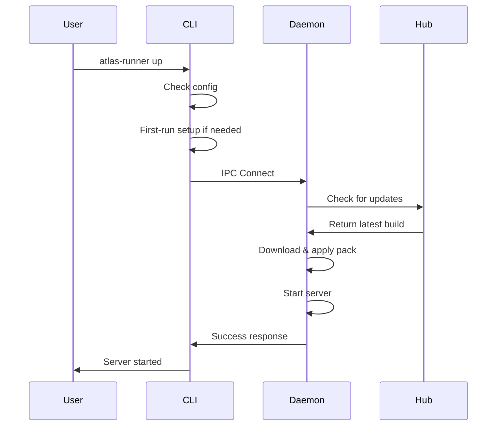

# Atlas Runner CLI Developer Documentation

The Atlas Runner CLI (`atlas-runner`) is a Rust application that provides command-line access to Atlas Runner daemon functionality.

## Architecture

### Dependencies
```toml
[dependencies]
clap = { version = "4.0", features = ["derive"] }     # CLI argument parsing
tokio = { version = "1.0", features = ["full"] }      # Async runtime
serde = { version = "1.0", features = ["derive"] }    # Serialization
anyhow = "1.0"                                        # Error handling
atlas-client = { path = "../atlas-client" }           # Hub API client
runner-core-v2 = { path = "../runner-core-v2" }       # Shared types
runner-ipc-v2 = { path = "../runner-ipc-v2" }         # IPC communication
```

### Module Structure
```
src/
├── main.rs              # Application entry point
├── commands/            # Command implementations
│   ├── core.rs         # Core commands (up, down, status)
│   ├── supervisor.rs   # Daemon management
│   ├── auth.rs         # Authentication
│   └── systemd.rs      # Systemd integration
├── client/              # IPC client
│   ├── mod.rs          # IPC client implementation
│   └── connection.rs   # Socket connection handling
├── config.rs            # Configuration management
└── lib.rs               # Library interface
```

## Core Components

### Command Line Interface

#### CLI Structure
```rust
use clap::{Parser, Subcommand};

#[derive(Parser)]
#[command(name = "atlas-runner")]
#[command(about = "Atlas Runner CLI")]
pub struct Cli {
    #[command(subcommand)]
    pub command: Commands,
}

#[derive(Subcommand)]
pub enum Commands {
    /// Start the server
    Up,
    /// Stop the server
    Down,
    /// Show server status
    Status,
    // ... other commands
}
```

#### Command Handlers
Each command is implemented as an async function:

```rust
pub async fn up_command() -> Result<(), anyhow::Error> {
    // Interactive setup if needed
    ensure_config()?;

    // Connect to daemon
    let mut client = IpcClient::connect().await?;

    // Send start request
    let response = client.start_server().await?;

    println!("Server started with PID: {}", response.pid);
    Ok(())
}
```

### IPC Client

#### Connection Management
```rust
pub struct IpcClient {
    stream: tokio::net::UnixStream,
    codec: LengthDelimitedCodec<BytesCodec>,
}

impl IpcClient {
    pub async fn connect() -> Result<Self> {
        let path = get_socket_path();
        let stream = UnixStream::connect(&path).await?;
        let codec = LengthDelimitedCodec::new();

        Ok(Self { stream, codec })
    }
}
```

#### Message Handling
```rust
impl IpcClient {
    pub async fn send_request(&mut self, req: Request) -> Result<Response> {
        // Serialize request
        let bytes = req.encode_to_vec();

        // Send with length prefix
        self.codec.send(bytes.into()).await?;

        // Receive response
        let response_bytes = self.codec.next().await?;
        let response = Response::decode(&response_bytes)?;

        Ok(response)
    }
}
```

### Configuration Management

#### Config Structure
```rust
#[derive(Serialize, Deserialize)]
pub struct DeployConfig {
    pub hub_url: String,
    pub pack_id: String,
    pub channel: String,
    pub deploy_token: String,
    pub max_ram_mb: u64,
    pub should_autostart: bool,
    pub eula_accepted: bool,
}

impl DeployConfig {
    pub fn load() -> Result<Self> {
        let path = config_path();
        let contents = fs::read_to_string(path)?;
        serde_json::from_str(&contents)
    }

    pub fn save(&self) -> Result<()> {
        let path = config_path();
        let contents = serde_json::to_string_pretty(self)?;
        fs::write(path, contents)?;
        Ok(())
    }
}
```

#### First-Run Setup
```rust
pub async fn ensure_config() -> Result<()> {
    if config_exists() {
        return Ok(());
    }

    println!("First-time setup required...");

    // Interactive prompts
    let hub_url = prompt_hub_url()?;
    let pack_id = prompt_pack_id()?;
    let channel = prompt_channel()?;
    let max_ram = prompt_ram()?;

    // Authentication
    let token = authenticate_user().await?;

    // Create config
    let config = DeployConfig {
        hub_url,
        pack_id,
        channel,
        deploy_token: token,
        max_ram_mb: max_ram,
        should_autostart: true,
        eula_accepted: false,
    };

    config.save()?;
    Ok(())
}
```

## Key Workflows

### Server Startup Flow


### Authentication Flow
```rust
pub async fn authenticate_user() -> Result<String> {
    // Device code flow
    let client = HubClient::new(hub_url)?;
    let device_code = client.start_device_auth().await?;

    println!("Visit: {}", device_code.verification_uri);
    println!("Code: {}", device_code.user_code);

    // Poll for completion
    let token = client.poll_device_token(&device_code).await?;

    Ok(token.access_token)
}
```

## Error Handling

### Error Types
```rust
#[derive(thiserror::Error, Debug)]
pub enum CliError {
    #[error("Configuration error: {0}")]
    Config(#[from] ConfigError),

    #[error("IPC communication error: {0}")]
    Ipc(#[from] IpcError),

    #[error("Authentication error: {0}")]
    Auth(#[from] AuthError),

    #[error("User input error: {0}")]
    Input(#[from] InputError),
}
```

### Error Recovery
```rust
pub async fn handle_command_error(error: CliError) -> Result<()> {
    match error {
        CliError::Config(_) => {
            println!("Configuration issue. Run setup again:");
            println!("  atlas-runner config reset");
        }
        CliError::Ipc(_) => {
            println!("Daemon not running. Start it with:");
            println!("  atlas-runner daemon-start");
        }
        CliError::Auth(_) => {
            println!("Authentication failed. Try again:");
            println!("  atlas-runner auth login");
        }
        _ => {
            println!("Unexpected error: {}", error);
        }
    }
    Ok(())
}
```

## Testing

### Unit Tests
```rust
#[cfg(test)]
mod tests {
    use super::*;

    #[test]
    fn test_config_serialization() {
        let config = DeployConfig::default();
        let json = serde_json::to_string(&config).unwrap();
        let deserialized: DeployConfig = serde_json::from_str(&json).unwrap();
        assert_eq!(config.pack_id, deserialized.pack_id);
    }
}
```

### Integration Tests
```rust
#[cfg(test)]
mod integration_tests {
    use super::*;
    use tempfile::TempDir;

    #[tokio::test]
    async fn test_full_startup_flow() {
        let temp_dir = TempDir::new().unwrap();

        // Mock daemon
        // Test CLI commands
        // Verify IPC communication
    }
}
```

## Performance Considerations

### Startup Time
- Config loading: <10ms
- IPC connection: <50ms
- Command execution: <100ms typical

### Memory Usage
- Base footprint: ~5MB
- Peak during auth: ~20MB
- Scales with log output

### Network I/O
- Authentication: OAuth HTTPS calls
- IPC: Local socket communication
- Status checks: Minimal data transfer

## Security

### File Permissions
```rust
pub fn set_secure_permissions(path: &Path) -> Result<()> {
    #[cfg(unix)]
    {
        use std::os::unix::fs::PermissionsExt;
        let mut perms = fs::metadata(path)?.permissions();
        perms.set_mode(0o600); // Owner read/write only
        fs::set_permissions(path, perms)?;
    }
    Ok(())
}
```

### Token Storage
- Deploy tokens encrypted at rest
- File permissions restrict access
- No tokens in logs or error messages

## Extensibility

### Adding New Commands
1. Add variant to `Commands` enum
2. Implement command handler function
3. Add routing in `main.rs`
4. Update help text and documentation

### Custom IPC Messages
1. Update `Request`/`Response` protobuf definitions
2. Regenerate Rust code from proto files
3. Implement handler in daemon
4. Add CLI client method

## Debugging

### Debug Logging
```rust
use tracing::{info, warn, error};

#[tokio::main]
async fn main() -> Result<()> {
    tracing_subscriber::init();

    info!("CLI starting");
    // ... application logic
    info!("CLI finished");
}
```

### Debug Commands
```bash
# Verbose output
atlas-runner --verbose status

# Debug IPC messages
atlas-runner --debug ping

# Log to file
atlas-runner --log-file debug.log up
```

## Distribution

### Binary Distribution
```bash
# Build release binary
cargo build --release -p runner-v2

# Package for distribution
tar -czf atlas-runner-linux-x64.tar.gz target/release/atlas-runner
```

### Platform Support
- Linux x86_64 (primary)
- macOS x86_64/arm64
- Windows x86_64
- Cross-compilation support

## Maintenance

### Dependency Updates
```bash
# Check for updates
cargo outdated

# Update dependencies
cargo update

# Test after updates
cargo test
```

### Code Quality
```bash
# Lint code
cargo clippy

# Format code
cargo fmt

# Security audit
cargo audit
```