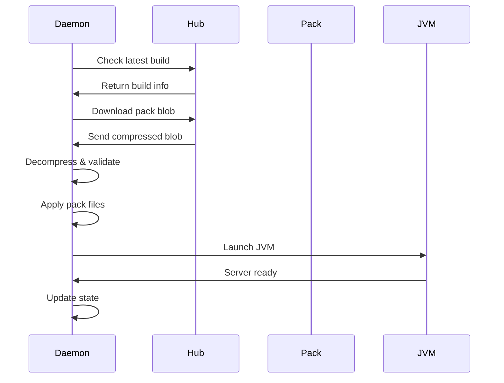
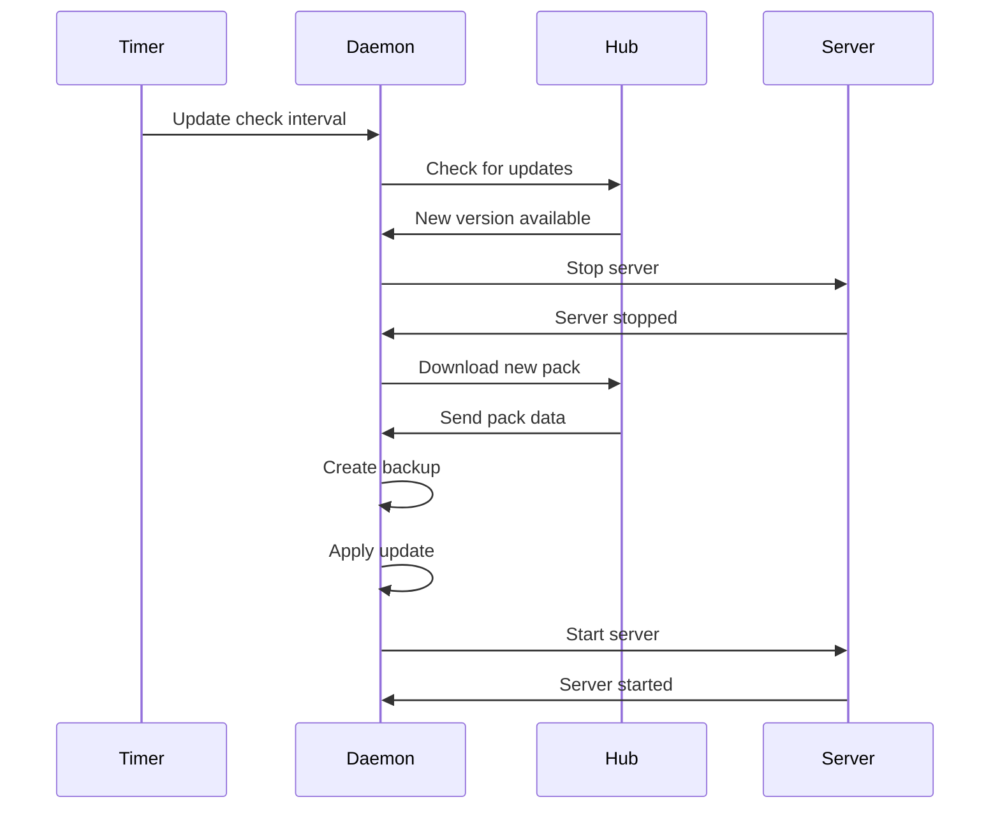

# Atlas Runner Daemon Developer Documentation

The Atlas Runner Daemon (`atlas-runnerd`) is a long-running service that manages Minecraft server lifecycle, handles updates, and provides IPC interface for the CLI.

## Architecture

### Dependencies
```toml
[dependencies]
tokio = { version = "1.0", features = ["full"] }      # Async runtime
serde = { version = "1.0", features = ["derive"] }    # Serialization
anyhow = "1.0"                                        # Error handling
tracing = "0.1"                                       # Logging
atlas-client = { path = "../atlas-client" }           # Hub API client
runner-core-v2 = { path = "../runner-core-v2" }       # Shared types
runner-ipc-v2 = { path = "../runner-ipc-v2" }         # IPC protocol
runner-provision-v2 = { path = "../runner-provision-v2" } # Server provisioning
runner-v2-rcon = { path = "../runner-v2-rcon" }       # RCON client
runner-v2-utils = { path = "../runner-v2-utils" }     # Utilities
```

### Module Structure
```
src/
├── main.rs              # Service entry point
├── server.rs            # IPC server implementation
├── supervisor.rs        # Server process management
├── updater.rs           # Pack update handling
├── config.rs            # Configuration management
├── state.rs             # Runtime state management
├── handlers/            # IPC request handlers
│   ├── core.rs         # Core operations (start/stop/status)
│   ├── config.rs       # Configuration management
│   ├── backup.rs       # Backup operations
│   └── logs.rs         # Log streaming
└── lib.rs               # Library interface
```

## Core Components

### Service Lifecycle

#### Initialization
```rust
#[tokio::main]
async fn main() -> Result<()> {
    // Initialize tracing
    tracing_subscriber::init();

    info!("Atlas Runner Daemon starting");

    // Load configuration
    let config = DaemonConfig::load()?;

    // Initialize state
    let state = Arc::new(RwLock::new(DaemonState::new()));

    // Start IPC server
    let ipc_server = IpcServer::new(config.socket_path.clone());
    let ipc_handle = tokio::spawn(async move {
        ipc_server.run(state.clone()).await
    });

    // Start update checker
    let update_handle = tokio::spawn(async move {
        update_checker(state.clone()).await
    });

    // Wait for shutdown signal
    tokio::signal::ctrl_c().await?;
    info!("Shutdown signal received");

    // Graceful shutdown
    ipc_handle.abort();
    update_handle.abort();

    Ok(())
}
```

#### Configuration
```rust
#[derive(Serialize, Deserialize)]
pub struct DaemonConfig {
    pub socket_path: PathBuf,
    pub data_dir: PathBuf,
    pub log_dir: PathBuf,
    pub backup_dir: PathBuf,
    pub update_interval: Duration,
    pub max_backups: usize,
}

impl Default for DaemonConfig {
    fn default() -> Self {
        Self {
            socket_path: PathBuf::from("/tmp/atlas-runner.sock"),
            data_dir: PathBuf::from("./data"),
            log_dir: PathBuf::from("./logs"),
            backup_dir: PathBuf::from("./backups"),
            update_interval: Duration::from_secs(300), // 5 minutes
            max_backups: 10,
        }
    }
}
```

### IPC Server

#### Server Implementation
```rust
pub struct IpcServer {
    socket_path: PathBuf,
    listener: Option<UnixListener>,
}

impl IpcServer {
    pub async fn run(self, state: Arc<RwLock<DaemonState>>) -> Result<()> {
        let listener = UnixListener::bind(&self.socket_path)?;
        info!("IPC server listening on {:?}", self.socket_path);

        loop {
            let (stream, _) = listener.accept().await?;
            let state = state.clone();

            tokio::spawn(async move {
                if let Err(e) = handle_connection(stream, state).await {
                    error!("Connection error: {}", e);
                }
            });
        }
    }
}
```

#### Connection Handler
```rust
async fn handle_connection(
    stream: UnixStream,
    state: Arc<RwLock<DaemonState>>,
) -> Result<()> {
    let mut codec = LengthDelimitedCodec::new();
    let mut framed = Framed::new(stream, codec);

    while let Some(frame) = framed.next().await {
        let bytes = frame?;
        let request = Request::decode(&bytes)?;

        let response = handle_request(request, &state).await;
        let response_bytes = response.encode_to_vec();

        framed.send(response_bytes.into()).await?;
    }

    Ok(())
}
```

### Server Supervisor

#### Process Management
```rust
pub struct ServerSupervisor {
    process: Option<Child>,
    config: ServerConfig,
    state: ServerState,
}

impl ServerSupervisor {
    pub async fn start(&mut self) -> Result<()> {
        // Prepare JVM arguments
        let jvm_args = self.build_jvm_args();

        // Set working directory
        let working_dir = self.config.server_dir.clone();

        // Start process
        let child = Command::new("java")
            .args(&jvm_args)
            .current_dir(&working_dir)
            .stdout(Stdio::piped())
            .stderr(Stdio::piped())
            .spawn()?;

        self.process = Some(child);
        self.state = ServerState::Starting;

        // Monitor process
        self.monitor_process().await?;

        Ok(())
    }

    pub async fn stop(&mut self) -> Result<()> {
        if let Some(mut child) = self.process.take() {
            // Try graceful shutdown first
            if let Some(rcon) = &self.rcon_client {
                rcon.send_command("stop").await?;
                // Wait for process to exit
                tokio::time::timeout(Duration::from_secs(30), child.wait()).await??;
            } else {
                // Force kill
                child.kill().await?;
            }
        }

        self.state = ServerState::Stopped;
        Ok(())
    }
}
```

#### JVM Launch Configuration
```rust
impl ServerSupervisor {
    fn build_jvm_args(&self) -> Vec<String> {
        let mut args = Vec::new();

        // Memory settings
        args.push(format!("-Xmx{}M", self.config.max_memory_mb));
        args.push(format!("-Xms{}M", self.config.min_memory_mb));

        // JVM flags
        args.extend_from_slice(&[
            "-XX:+UseG1GC",
            "-XX:+ParallelRefProcEnabled",
            "-XX:MaxGCPauseMillis=200",
            "-XX:+UnlockExperimentalVMOptions",
            "-XX:+DisableExplicitGC",
            "-XX:+AlwaysPreTouch",
            "-XX:G1NewSizePercent=30",
            "-XX:G1MaxNewSizePercent=40",
            "-XX:G1HeapRegionSize=8M",
            "-XX:G1ReservePercent=20",
            "-XX:G1HeapWastePercent=5",
            "-XX:G1MixedGCCountTarget=4",
            "-XX:InitiatingHeapOccupancyPercent=15",
            "-XX:G1MixedGCLiveThresholdPercent=90",
            "-XX:G1RSetUpdatingPauseTimePercent=5",
            "-XX:SurvivorRatio=32",
            "-XX:+PerfDisableSharedMem",
            "-XX:MaxTenuringThreshold=1",
        ]);

        // JAR file
        args.push("-jar".to_string());
        args.push(self.config.jar_path.to_string());

        // Server arguments
        args.push("nogui".to_string());

        args
    }
}
```

### Update System

#### Update Checker
```rust
async fn update_checker(state: Arc<RwLock<DaemonState>>) -> Result<()> {
    let mut interval = tokio::time::interval(Duration::from_secs(300));

    loop {
        interval.tick().await;

        let current_version = {
            let state = state.read().await;
            state.current_pack_version.clone()
        };

        // Check for updates
        match check_for_updates(&current_version).await {
            Ok(Some(new_version)) => {
                info!("New version available: {}", new_version);
                // Trigger update process
                perform_update(&new_version, &state).await?;
            }
            Ok(None) => {
                debug!("No updates available");
            }
            Err(e) => {
                error!("Update check failed: {}", e);
            }
        }
    }
}
```

#### Update Process
```rust
async fn perform_update(
    new_version: &str,
    state: &Arc<RwLock<DaemonState>>,
) -> Result<()> {
    info!("Starting update to version {}", new_version);

    // Stop server if running
    {
        let mut state = state.write().await;
        if state.server_state == ServerState::Running {
            state.supervisor.stop().await?;
        }
    }

    // Download new pack
    let pack_data = download_pack(new_version).await?;

    // Backup current installation
    create_backup().await?;

    // Apply new pack
    apply_pack_update(pack_data).await?;

    // Restart server
    {
        let mut state = state.write().await;
        state.supervisor.start().await?;
        state.current_pack_version = new_version.to_string();
    }

    info!("Update completed successfully");
    Ok(())
}
```

### State Management

#### Daemon State
```rust
#[derive(Clone)]
pub struct DaemonState {
    pub server_state: ServerState,
    pub current_pack_version: String,
    pub config: DeployConfig,
    pub supervisor: ServerSupervisor,
    pub last_update_check: DateTime<Utc>,
    pub backup_history: Vec<BackupInfo>,
}

#[derive(Clone, PartialEq)]
pub enum ServerState {
    Stopped,
    Starting,
    Running,
    Stopping,
    Error(String),
}
```

#### Thread-Safe Access
```rust
pub async fn get_server_status(state: &Arc<RwLock<DaemonState>>) -> ServerStatus {
    let state = state.read().await;

    ServerStatus {
        state: state.server_state.clone(),
        version: state.current_pack_version.clone(),
        uptime: state.supervisor.uptime(),
        memory_usage: state.supervisor.memory_usage(),
        player_count: state.supervisor.player_count(),
    }
}
```

## Key Workflows

### Server Startup Flow


### Update Flow


## Error Handling

### Error Types
```rust
#[derive(thiserror::Error, Debug)]
pub enum DaemonError {
    #[error("IPC error: {0}")]
    Ipc(#[from] IpcError),

    #[error("Server process error: {0}")]
    Server(#[from] ServerError),

    #[error("Update error: {0}")]
    Update(#[from] UpdateError),

    #[error("Configuration error: {0}")]
    Config(#[from] ConfigError),

    #[error("IO error: {0}")]
    Io(#[from] std::io::Error),
}
```

### Recovery Strategies
```rust
impl ServerSupervisor {
    pub async fn handle_process_error(&mut self, error: ServerError) -> Result<()> {
        match error {
            ServerError::Crashed(exit_code) => {
                warn!("Server crashed with code {}", exit_code);

                // Check crash frequency
                if self.crash_count > 5 {
                    error!("Too many crashes, entering error state");
                    self.state = ServerState::Error("Frequent crashes".to_string());
                    return Ok(());
                }

                // Attempt restart
                self.crash_count += 1;
                self.restart().await?;
            }
            ServerError::OutOfMemory => {
                warn!("Server out of memory");

                // Increase memory allocation
                self.config.max_memory_mb += 1024;
                self.restart().await?;
            }
            _ => {
                error!("Unhandled server error: {}", error);
                self.state = ServerState::Error(error.to_string());
            }
        }
        Ok(())
    }
}
```

## Performance Considerations

### Resource Usage
- Memory: 50-200MB base + JVM allocation
- CPU: Minimal when server idle, scales with player activity
- Disk I/O: Pack downloads, log writing, backups
- Network: Update checks, pack downloads

### Optimization Strategies
```rust
// Connection pooling for Hub API
lazy_static::lazy_static! {
    static ref HTTP_CLIENT: Client = Client::builder()
        .pool_max_idle_per_host(10)
        .timeout(Duration::from_secs(30))
        .build()
        .unwrap();
}

// Buffered logging
pub struct AsyncLogger {
    sender: mpsc::UnboundedSender<LogEntry>,
    handle: JoinHandle<()>,
}

impl AsyncLogger {
    pub fn new(log_path: PathBuf) -> Self {
        let (sender, mut receiver) = mpsc::unbounded_channel();

        let handle = tokio::spawn(async move {
            let mut file = OpenOptions::new()
                .create(true)
                .append(true)
                .open(log_path)
                .await
                .unwrap();

            while let Some(entry) = receiver.recv().await {
                let line = format!("{} {}\n", entry.timestamp, entry.message);
                file.write_all(line.as_bytes()).await.unwrap();
            }
        });

        Self { sender, handle }
    }
}
```

## Security

### Process Isolation
- Server runs as separate process
- Limited file system access
- Network restrictions via firewall rules

### Data Protection
```rust
pub async fn secure_data_directory(dir: &Path) -> Result<()> {
    #[cfg(unix)]
    {
        use std::os::unix::fs::PermissionsExt;

        // Set directory permissions
        let mut perms = fs::metadata(dir)?.permissions();
        perms.set_mode(0o755);
        fs::set_permissions(dir, perms)?;

        // Secure sensitive files
        for entry in fs::read_dir(dir)? {
            let entry = entry?;
            let path = entry.path();

            if path.extension() == Some(OsStr::new("key")) ||
               path.file_name() == Some(OsStr::new("deploy-token")) {
                let mut perms = fs::metadata(&path)?.permissions();
                perms.set_mode(0o600);
                fs::set_permissions(&path, perms)?;
            }
        }
    }
    Ok(())
}
```

## Testing

### Unit Tests
```rust
#[cfg(test)]
mod tests {
    use super::*;
    use tempfile::TempDir;

    #[tokio::test]
    async fn test_server_startup() {
        let temp_dir = TempDir::new().unwrap();

        let config = ServerConfig {
            server_dir: temp_dir.path().to_path_buf(),
            jar_path: "test.jar".into(),
            max_memory_mb: 1024,
            min_memory_mb: 512,
        };

        let mut supervisor = ServerSupervisor::new(config);
        // Mock the JVM process
        // Test startup logic
    }
}
```

### Integration Tests
```rust
#[cfg(test)]
mod integration_tests {
    use super::*;
    use std::sync::Arc;
    use tokio::sync::RwLock;

    #[tokio::test]
    async fn test_ipc_communication() {
        let state = Arc::new(RwLock::new(DaemonState::new()));

        // Start test IPC server
        let server_handle = tokio::spawn(async move {
            let server = IpcServer::new("/tmp/test.sock".into());
            server.run(state).await
        });

        tokio::time::sleep(Duration::from_millis(100)).await;

        // Connect as client
        let mut client = IpcClient::connect("/tmp/test.sock").await.unwrap();

        // Test commands
        let status = client.get_status().await.unwrap();
        assert_eq!(status.state, ServerState::Stopped);

        server_handle.abort();
    }
}
```

## Monitoring

### Health Checks
```rust
pub async fn health_check(state: &Arc<RwLock<DaemonState>>) -> HealthStatus {
    let state = state.read().await;

    let mut status = HealthStatus {
        overall: Health::Healthy,
        checks: HashMap::new(),
    };

    // IPC server check
    status.checks.insert(
        "ipc_server".to_string(),
        check_ipc_server().await,
    );

    // Server process check
    status.checks.insert(
        "server_process".to_string(),
        check_server_process(&state).await,
    );

    // Disk space check
    status.checks.insert(
        "disk_space".to_string(),
        check_disk_space().await,
    );

    // Update overall status
    if status.checks.values().any(|h| *h == Health::Unhealthy) {
        status.overall = Health::Unhealthy;
    }

    status
}
```

### Metrics Collection
```rust
pub struct Metrics {
    pub uptime_seconds: u64,
    pub memory_usage_mb: u64,
    pub cpu_usage_percent: f64,
    pub player_count: u32,
    pub bytes_downloaded: u64,
    pub update_count: u32,
}

impl Metrics {
    pub async fn collect(state: &Arc<RwLock<DaemonState>>) -> Self {
        let state = state.read().await;

        Self {
            uptime_seconds: state.supervisor.uptime().as_secs(),
            memory_usage_mb: state.supervisor.memory_usage(),
            cpu_usage_percent: state.supervisor.cpu_usage(),
            player_count: state.supervisor.player_count(),
            bytes_downloaded: state.metrics.bytes_downloaded,
            update_count: state.metrics.update_count,
        }
    }
}
```

## Distribution

### Service Installation
```bash
# Install systemd service
sudo cp atlas-runnerd.service /etc/systemd/system/
sudo systemctl daemon-reload
sudo systemctl enable atlas-runnerd
sudo systemctl start atlas-runnerd

# Check status
sudo systemctl status atlas-runnerd
```

### Platform Support
- Linux (systemd service)
- macOS (launchd service)
- Windows (Windows Service)

## Maintenance

### Log Rotation
```bash
# Configure logrotate
cat > /etc/logrotate.d/atlas-runnerd << EOF
/var/log/atlas-runnerd/*.log {
    daily
    rotate 7
    compress
    delaycompress
    missingok
    notifempty
    create 644 atlas-runnerd atlas-runnerd
    postrotate
        systemctl reload atlas-runnerd
    endscript
}
EOF
```

### Backup Strategy
```rust
pub async fn create_backup() -> Result<BackupInfo> {
    let timestamp = Utc::now();
    let backup_name = format!("backup-{}.tar.gz", timestamp.format("%Y%m%d-%H%M%S"));

    // Create backup directory if needed
    fs::create_dir_all(&self.config.backup_dir).await?;

    // Compress current server directory
    let backup_path = self.config.backup_dir.join(&backup_name);

    let mut cmd = Command::new("tar");
    cmd.arg("-czf")
       .arg(&backup_path)
       .arg("-C")
       .arg(&self.config.server_dir)
       .arg(".");

    cmd.status().await?;

    // Clean old backups
    self.cleanup_old_backups().await?;

    Ok(BackupInfo {
        name: backup_name,
        timestamp,
        size_bytes: fs::metadata(&backup_path).await?.len(),
    })
}
```

### Troubleshooting

#### Common Issues
1. **Socket connection refused**
   - Check if daemon is running: `systemctl status atlas-runnerd`
   - Verify socket permissions: `ls -la /tmp/atlas-runner.sock`

2. **Server won't start**
   - Check Java installation: `java -version`
   - Verify JAR file exists and is executable
   - Check available memory vs configured limits

3. **Update failures**
   - Verify network connectivity to Hub
   - Check disk space: `df -h`
   - Review daemon logs: `journalctl -u atlas-runnerd`

#### Debug Mode
```bash
# Enable debug logging
sudo systemctl edit atlas-runnerd
# Add: Environment=RUST_LOG=debug

sudo systemctl restart atlas-runnerd

# View logs
journalctl -u atlas-runnerd -f
```